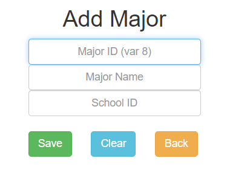

  <b>数据库Web实验报告</b>

[TOC]

### 一、实验目的

​		通过设计和实现一个实际应用场景，熟悉和掌握数据库的基础知识，包括关系模型的设计、ER图的绘制、数据表的设计和建立、对表内数据的增删查改等联合操作；同时，熟悉前后端分离的交互原理，入门以Django为核心的MVU设计模式，了解并使用HTML/CSS/JavaScript设计前端的思路和方法。

### 二、实验原理

#### 1. 前后端分离

​		简单来说，前后端分离就是把前端显示和后端操作分开，让前端专心负责界面相关逻辑，后端专心负责处理数据。前后端之间通过请求进行交互。前端把请求发给后端，后端接受请求之后进行处理，把处理结果返回给前端。这样做的好处是有一个清晰的逻辑分割，方便分工协作（实际上都是我自己写的@_@），在debug和项目调整的时候也比较方便，不用牵一发而动全身。

#### 2. Django设计模式 (MTV)

​		MTV设计模式是指：**Model, Template, View**，这样的分割方式和前后端分离一样本身就是方便“专人专干”，通过解耦提高代码块的可移植性和兼容性。

>   1.  **Model（模型）**Model负责的是数据库层的内容，包括表单的建立、增删查改，和View层进行交互。本次实验中对表单的增删查改出现在view中是因为Django良好的封装性使得对数据库的访问只需要掉一个函数，所以不需要单独封装数据库交互的函数。
>   2.  **Template（模板）** Template负责的是前端显示的内容，主要是HTML文件，结合CSS和JS对模板的渲染和操作。
>   3.  **View（视图）** View里完成的是对前台返回的请求的响应操作。前台返回的请求通过url定向到不同的view函数，在函数里对请求进行解析，完成操作后把结果应答给前端。

#### 3. 使用工具：

##### 3.1 环境

​	**Django 2.1.7**  

​	**Bootstrap 3.3.7**

​	**Python 3.6.8**

##### 3.2 工具

​	**PyCharm 2018.2.4 PE**

​	**MySQL Work Bench 8.0.15 CE**

​	**Google Chrome  74.0.3729.131 (Official Build) (64-bit)**

##### 3.3 语言

​	Python3

​	HTML/CSS/JavaScript

​	MySQL

### 三、实验内容

#### 1. 需求描述 (Problem Description)

​        我想实现一个能够**面向不同角色的用户**展示教务系统的应用，我把它取名叫做FDUSystem。在这个教务系统中，**用户分为三类：学生/老师/教务员**。默认每个人知道自己的学号/工号，并以此作为注册用户时的依据，每个账户绑定唯一的学号或工号。**针对不同用户，我赋予他们不同的权限**。教务员拥有最高权限，学生和老师对数据库中的大多数信息只能浏览和查找，但仍然有一些例外，详细请看2、3部分的数据库模型和建表。

#### 2. 概念模型 (ER Concept Model)

经过一番考虑，初步设计的ER关系模型如下，详细介绍见**3.逻辑模型**部分。

>   **Note:** 
>
>   1.  学生和专业之间存在N:1隶属关系。
>   2.  专业和学院之间存在N:1隶属关系。
>   3.  老师和学院之间存在N:1隶属关系。
>   4.  老师和课程之间存在1:N授课关系。
>   5.  学生和课程之间存在M:N的选课关系。
>   6.  课程与课程之间存在1:1的先修课关系。
>   7.  课程与教室之间存在N:1的地点关系。
>   8.  用户与用户扩展之间存在1:1的对应关系。
>   9.  注册用户通过用户扩展表中的uesr_number与内容表相联系。

#### 3. 逻辑模型 (DB Model)

​        我把数据库需要设计的模型简单分为以下两类：**内容数据模型/应用数据模型**。

##### 3.1 内容数据模型 (Content Data Model)

​		内容数据模型主要有以下几张表：

###### 3.1.1 School

|   Attribute   |  Properties   |
| :-----------: | :-----------: |
| **school_id** | varchar(4) PK |
|  school_name  |  varchar(50)  |

>   **Note: **学院表记录两个信息：学院编码和学院名字，主键如上所示。

###### 3.1.2 Major

|      Attribute      |  Properties   |
| :-----------------: | :-----------: |
|    **major_id**     | varchar(8) PK |
|     major_name      |  varchar(50)  |
| **major_school_id** |  varchar(4)   |

>   **Note:** 专业表记录专业编码和专业名称，专业对应的学院的id作为外键。

###### 3.1.3 Teacher

|       Attribute       |  Properties   |
| :-------------------: | :-----------: |
|    **teacher_id**     | varchar(5) PK |
|     teacher_name      |  varchar(50)  |
|      teacher_sex      |  varchar(20)  |
|      teacher_age      |    int(11)    |
|     teacher_title     |  varchar(20)  |
|    teacher_salary     |    double     |
| **teacher_school_id** |  varchar(4)   |

>   **Note:** 教师表的主键是teacher_id，外键是teacher_school_id。

###### 3.1.4 Student

|    Attribute     |   Properties   |
| :--------------: | :------------: |
|    **stu_id**    | varchar(11) PK |
|     stu_name     |  varchar(50)   |
|     stu_sex      |  varchar(20)   |
|     stu_age      |    int(11)     |
| **stu_major_id** |   varchar(8)   |

>   **Note:** 学生表的外键是所属专业的id。

###### 3.1.5 Classroom

|     Attribute      |  Properties   |
| :----------------: | :-----------: |
|  **classroom_id**  | varchar(5) PK |
| classroom_capacity |    int(11)    |

>   **Note:** 教室记录了教室编号和教室容量。

###### 3.1.6 Course

|         Attribute          |  Properties   |
| :------------------------: | :-----------: |
|       **course_id**        | varchar(9) PK |
|        course_name         |  varchar(50)  |
|      course_capacity       |    int(11)    |
| **course_classroom_id_id** |  varchar(5)   |
|  **course_teacher_id_id**  |  varchar(5)   |

>   **Note:** 课程表的主键是course_id，外键有两个，一个指向这个课的上课地点，一个指向授课教师。

###### 3.1.7 SelectCourse

|      Attribute      |  Properties   |
| :-----------------: | :-----------: |
|       **id**        | int(11) AI PK |
|      sc_score       |    int(11)    |
| **sc_course_id_id** |  varchar(9)   |
|  **sc_stu_id_id**   |  varchar(11)  |

>   **Note:** 选课这张表有一个系统自动分配的主键id，有两个外键分别指向课程和学生。

###### 3.1.8 PreCourse

|      Attribute       |  Properties   |
| :------------------: | :-----------: |
|        **id**        | int(11) AI PK |
| **cur_course_id_id** |  varchar(9)   |
| **pre_course_id_id** |  varchar(9)   |

>   **Note: **先修课这张表同样有一个自动分配的主键id，外键指向两门不同的课程。

##### 3.2 应用数据模型 (Application Data Model)

​		应用数据模型主要包括User/Group/Permission三个模型。起初我想自己设计，但是在阅读完Django官方文档后，我发现Django自带这三个模型，但是为了使用户能够绑定内容数据里唯一的学号/工号，我把Django自带的User Model进行了扩展。

###### 3.2.1 User & User Extension

​        Django自带的User Model有以下属性

|  Attribute   |  Properties   |
| :----------: | :-----------: |
|      id      | int(11) AI PK |
| **password** | varchar(128)  |
|  last_login  |  datetime(6)  |
| is_superuser |  tinyint(1)   |
| **username** | varchar(150)  |
|  first_name  |  varchar(30)  |
|  last_name   | varchar(150)  |
|  **email**   | varchar(254)  |
|   is_staff   |  tinyint(1)   |
|  is_active   |  tinyint(1)   |
| date_joined  |  datetime(6)  |

>   **Note:**
>
>   1.  在存储密码的时候，一开始想调库**对密码进行加密**，后来发现Django又替我做了这个事情，用户注册输入的密码会被加密存储到数据库中。
>
>   2.  为了方便，在注册时我仅仅用到了username, password, email三个属性，已经足够接下来的一些简单操作，更进一步的操作留待功能完善。

​		为了让用户能够绑定学号/工号以确认身份，我设计了**UserExtension**模型来存储用户注册的重要信息。

|    Attribute    |  Properties   |
| :-------------: | :-----------: |
|     **id**      | int(11) AI PK |
|   **user_id**   |    int(11)    |
|   user_belong   |  varchar(10)  |
| **user_number** |  varchar(11)  |

>   **Note:**  
>
>   1. user_id是指向User中id属性的外键；
>   2. user_belong有‘admin’, ‘student’, ‘teacher’三个选项；
>   3. user_number存的是用户的学号/工号；
>   4. id由系统自动生成不重复的值；

###### 3.2.2 Group& Group Permission

​		Django自带的User Group和 Permission 模型能够方便地对用户进行分组并且统一设置相应的权限。

Group:

| Attribute |  Properties   |
| :-------: | :-----------: |
|  **id**   | int(11) AI PK |
| **name**  |  varchar(80)  |

Permission:

|      Attribute      |  Properties   |
| :-----------------: | :-----------: |
|       **id**        | int(11) AI PK |
|        name         | varchar(255)  |
| **content_type_id** |    int(11)    |
|      codename       | varchar(100)  |

>   **Note:**
>
>   1.  我在Django自带的admin界面里**手动添加了三个用户组**：admin/student/teacher，并且赋予每个组不同的权限，具体见2.1.3部分。这里的admin是指我自己定义的组名，有时候提到的admin界面是指Django自带的超级用户管理界面。
>   2.  Group和Permission之间，在admin界面手动为每个用户组添加相应权限后，Django自动生成一个group_permission的多对一的关系，并生成一张表存储在数据库中。

###### 3.2.3 用户权限设置 (User Permission Management)

​        不同用户的权限目前主要拥有其所属用户组的所有权限。

>    **Note:** 
>
>   1.  只有拥有相应权限，才能在主页看到相应的按钮（add, delete, search, edit）；
>   2.  每一张表应有的增删查改功能我都实现了；

**3.2.3.1  admin组**

​        当用户注册成为一个教务员之后，其账户本身也是整个系统的超级管理员，能够登陆Django后台管理界面。admin组拥有几乎所有的权限，更**拥有对所有内容数据模型增删查改的权限**（涉及到在前端对内容数据模型的操作），但有一个例外：为了更贴近实际，我只允许教务员对SelectCourse那张表拥有**增删查**的权限，一旦增加某个选课item就**不再对其具有编辑更改权限**；并且，在新增一个选课item的时候，课程分数被默认设置成999（非正常值），这是因为教务员在应学生选课申请要求加课以后，课程还没有成绩。

    

        admin home page
    

**3.2.3.2  student组**

​		当用户注册为学生时，这个账户就绑定了一个学号。当其进入界面，能够看到的公共表有：学院、专业、老师（已屏蔽隐私信息）、学生（已屏蔽隐私信息）、课程、先修课、教室，**学生对这些公共表仅有查看和搜索的权限**。同时，享有一张**私人可见**的My Select Course表，这张表是在SelectCourse中根据用户绑定的学号查找生成的临时视图，在这个临时视图中，学生有**添加选课**item的权限，但是同样的**无法修改**已选课程并且分数被默认设置成999。

    

        student home page
    

**3.2.3.3  teacher组**

​		当用户注册为老师时，这个账户同样绑定一个教师工号。进入主页以后，老师看到的公共表与学生看到的并无差别，权限也仅仅限制在查看和搜索。类似地，老师有一张私人课件的表，是根据用户绑定的教师工号对应的所有教的课上的所有学生的选课item，在这张私人表中，老师可以通过**搜索查看**自己教的具体某一个课的所有学生的成绩并加以**修改**。然而，对每个元祖的**修改仅仅限制为修改学生的成绩，为学生打分**，但是老师没有添加或者删除学生选课的权限，也就是说，学生想要退课，只能去找教务员。这是符合实际的。

    

        teacher home page
    

#### 4. 前端设计 (Frontend Design)

​		整个前端设计都是基于bootstrap框架进行改造而成的，碰到了一些技术问题，下面分别概述：

##### 4.1 外主页 (index)

    

        index page
    

​		外主页主要实现了一些页面跳转逻辑，从外主页进入注册/登录页，左上角是一个返回外主页的超链接。

##### 4.2 注册 (sign up)

​		当跳转到注册页面之后，用户填写信息，这些信息被作为一个表单提交到后台，后台对这些信息进行检索，判断是否符合条件，然后将处理结果返回给前台。

​		在设计用户注册逻辑的时候，我考虑到一个**问题：怎么证明你是你？怎么防止你的学号/工号被他人知晓然后抢注绑定你的学号/工号？**在实际的教务网站运行过程中，初次注册时需要提交你的身份证号和学号，后台拥有身份证号和学号对应的数据，匹配成功以后，你提交的学号才会被绑定成功。但是在这里，我为了减小工作量，没有做以身份证号/手机号为参考标准的身份校验。

    

        sign up page
    

##### 4.3 登录 (sign in)

​		登录页有两个输入框，接收用户名和密码。接收完以后提交给后台进行验证，验证通过后进入登录后的主页。

    

        sign in page
    

##### 4.4 内主页 (home  page)

​		我把内主页要显示的**内容数据表都放在了一个HTML文件下**，点击左侧菜单栏右边会通过JavaScript控制每个div的显隐性，这样做有好处也有坏处，**好处**在于我不同更负责的url跳转逻辑；而**坏处**就是，当我对某个div内的表单进行增删查改的时候，页面刷新会回到默认显示的div，这样非常反人类。

​        为了解决这个问题，我把增查改的操作都跳转到其他url页面进行，操作完成后，回到主页，调用window.onload()，并在函数里判断进入增查改页面之前的一个url是什么，然后响应对应的JavaScript函数，虽然反应会略慢一点，好歹解决了主要问题。但是，仍然碰到的问题就是，在删除完某一项之后，刷新页面会回到默认div块。鉴于时间关系，我没来得及做更多的重构来修复这个bug。

​		另外，值得一说的是，为了**区分不同用户登录到内主页所看到的内容**，我对每个div甚至每个功能按钮（增删查改）**设置条件判断**，判断当前用户是否有xxx权限，如果有则显示该区域/按钮，如果没有，用户就看不到这些。

​		内主页的样式见**3.2.3 用户权限设置 (User Permission Management)**部分插图。

#### 5. 后端功能实现 (Backend Functions)

##### 5.1 注册登录 (sign up & sign in)

​		在前面说到，注册时把表单提交到后台，后台匹配url，然后再到views.py文件中匹配与url匹配的函数，调用该函数。于是，在signup函数里取出提交的注册信息，进行查重/输入密码是否一致等等操作；如果符合注册要求，则创建一个User对象，存入用户名、加密后的密码、邮件地址，并绑定一个UserExtension对象，绑定用户的学号/工号，保存到数据库并返回至登录页；否则就刷新注册页面；

​		注册完到达登陆页面之后，输入用户名和密码，提交给后台进行验证，如果验证成功，就跳转到内主页，否则刷新页面。

​		详细代码见views.py的signin, signup函数。

##### 5.2 增加数据 (add)

​		当用户点击某一个表单的增加按钮后，向后台发送url并跳转到“/add/xxx”，后台接收到这个url之后，匹配进入对应的函数 `(addpage(request))`；同样的，在跳转到“/add/xxx”之后，add.html会根据request的权限分别显示不同的div，这样就可以用同一个addpage完成对不同内容和数据的添加动作。想要添加的信息被提交给后台以后，后台会首先根据主键/外键在数据库中进行查重；如果查到已经存在某一项，则刷新页面重新添加；如果不存在重复表项，就调用对应的Model创建相应的对象；当用户添加完想添加的数据的时候，就可以点击返回主页了；返回时就涉及到前面说到的window.onload()函数根据上一个url区别执行当前页的js函数。

    

        以school/major/student的添加页面为例
    

>   **Note:** 图中仅截出部分增加功能，已实现教务员对所有可见表的增加功能。

##### 5.3 删除数据 (delete)

​		删除功能被限制给了教务员（admin）才有，只有admin的界面才会显示删除按钮，同样地已经实现了所有可见表的删除功能。当前端点击删除的时候，会触发复选框表单的action，给后台发一个url请求，附带有需要删除的表项的主键值。后台收到请求之后，根据url匹配对应的函数，根据传回的主键id对数据进行删除。删除完成以后刷新页面。

    

        以course/classroom/scorelist的删除为例
    

##### 5.4 查找数据 (search)

​		查找数据的原理与之前的类似，在每个表的右上方有搜索框，输入对应内容按下搜索按钮后，搜索框的内容被提交给后台，后台把数据拿到以后再在数据库中进行**模糊匹配**，将结果返回给search/xxx的html页，然后前端显示出来。

    

        search result page
    

>   **Note:** 
>
>   1.  search 功能实现和前端展示的原理和add page是基本相似的，把搜索结果拿到以后，重定向到search/xxx的页面，然后该页面同add page一样，根据跳转过来的request.path进行判断在search page应该显示哪些内容。

##### 5.5 修改数据 (update)

​		修改页面也是一个独立的页面，由公共表页面跳转到edit/xxxpage，跳转的时候自带需要修改的表项的信息，然后先返回给后台，后台拿到数据以后，先在数据库里找到该表项，把数据返回给edit page，然后定向到edit page，用户就能在edit page页面看到想要编辑的数据显示在输入框里。用户可以更改输入框里的值（除了主键值），改完以后点击提交，数据又作为一个表单被提交给后台，后台把提交的数据又更新到数据库，然后刷新页面。用户可以点击edit page 页面的返回按钮返回到主页。

    

        以course/teacher/major的编辑为例
    

>   **Note: **
>
>   1.  教务员（admin）的管理权限中，对三种身份的共有表单具有编辑权限（school，major，student，teacher，course，classroom，precourse），这是应有的权限。但是教务员不能修改scorelist的表项，因为教务员不该有权修改学生成绩，只能为学生选课或者退课。
>   2.  edit不允许修改主键是容易理解的，因为修改主键等价于添加一个新的表项。

#### 6. FDUSystem使用教程

​		详细的使用教程见README.md文件。

### 四、反思与收获

#### 1. 问题 (Problems)

(1) 最开始碰见的问题就是Django项目搭建起来之后，完全不知道前端请求发送过来之后，后端是怎么工作的。然后不断地查阅资料才搞清楚了。

(2) 另一个问题是我不清楚urls.py文件中的url路径应该怎么写，以至于最开始写views.py中的登录注册函数的时候总是无法生效；后来用print debug法定位了问题并找到了问题所在。

(3) 设计逻辑的时候，为怎么把多张表单显示在同一个页面犯愁，确定好显示在同一页面之后，对每张表单的操作完成以后如何返回原来的表单又成了问题，最后的解决办法是用js函数根据上一个url决定跳转的url。

(4)忘了。。。

#### 2. 收获 (Gain)

(1) 前后端分离的思想以及前后端交互的方式和逻辑

(2) Django的MVT设计模式

(3) 前端语言

#### 3. 反思 (Improve)

该项目仍然有诸多有待提高的地方：

(1) 由于url的设计不够合理，导致删除表单后会默认刷新页面，主页显示的东西会回到默认的div块。

(2) 在添加选课的时候，用户只能自己输入课程id，比较好的做法是用js向后台抓取所有数据填充到下拉选择框中，这样用户可以直接点击选中。

(3) 用户修改资料和重置密码等一些基础功能受限于时间关系还没完成。

(4) 没有部署到服务器上。

### 五、参考文献

[1] Django 文档 <https://docs.djangoproject.com/zh-hans/2.2/>

[2] HTML菜鸟教程 <https://www.runoob.com/html/html-tutorial.html>

[3] Bootstrap 手册 <https://v3.bootcss.com/>

